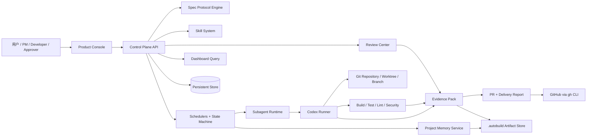
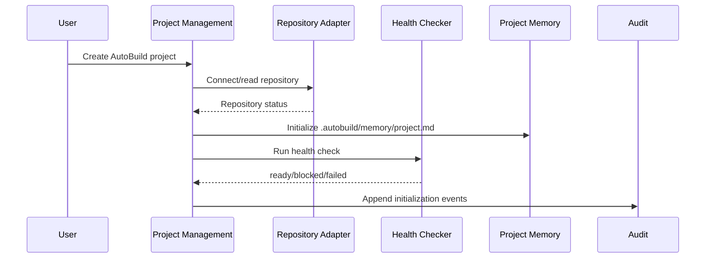
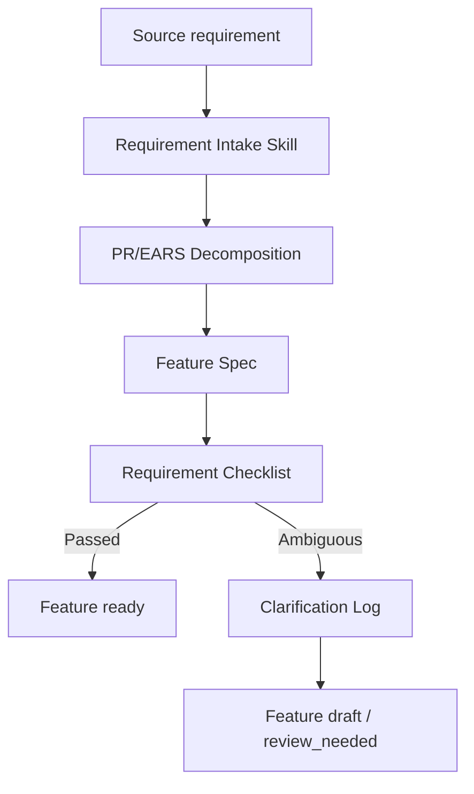
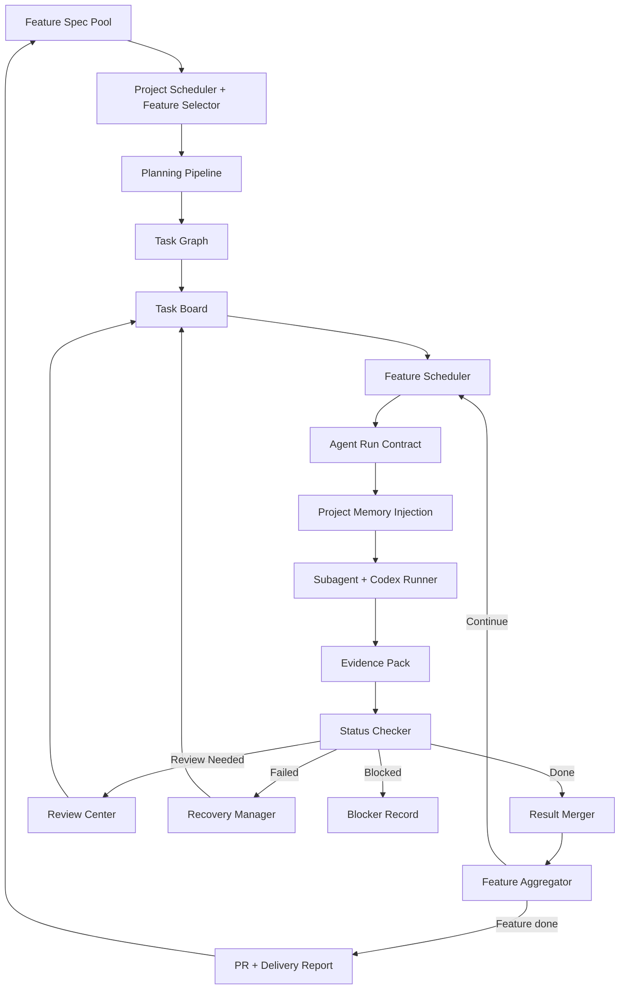
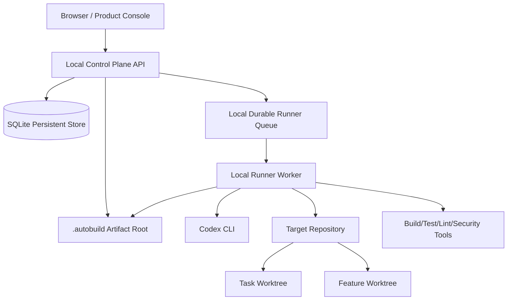

# HLD: SpecDrive AutoBuild

版本：V2.0  
状态：项目级高层设计  
来源：`docs/zh-CN/PRD.md`、`docs/zh-CN/requirements.md`、`docs/zh-CN/design.md`、`docs/zh-CN/spec-ref.md`

---

## 1. Overview

SpecDrive AutoBuild 是一个面向软件团队的长时间自主编程系统。系统以 Spec Protocol 管理目标、需求、验收和交付证据，以 Skill System 固化可复用工程方法，以 Subagent Runtime 隔离上下文并行处理任务，以 Project Memory 为 Codex CLI 提供跨会话恢复能力，以 Codex Runner 执行代码修改、测试、修复和 PR 生成，以内部任务状态机维护任务、审批、恢复和交付流转，并通过 Product Console / Dashboard 呈现状态。

本 HLD 定义项目级架构边界、技术栈、核心子系统、数据域、集成方式、运行拓扑、安全治理、可观测性和 Feature Spec 拆分方向。本文不定义具体接口字段、数据库迁移、函数签名、任务实现步骤或单个 Feature 的低层设计。

MVP 采用本地优先的控制面架构：

- Control Plane 维护项目、Spec、Skill、调度、状态、审批、Evidence、审计和查询。
- Execution Layer 通过 Subagent Runtime 与 Codex Runner 执行受约束的代码修改、测试和恢复。
- Git repository、worktree 和 branch 是写入隔离边界。
- Persistent Store 是调度和状态真实来源；Project Memory 是 CLI 恢复投影，不是调度真实来源。
- Dashboard 只展示控制面状态，并通过受控命令触发操作，不直接修改 Git 工作区。

## 2. Goals and Non-Goals

### Goals

- 从自然语言、PR、RP、PRD、EARS 或混合输入生成结构化 Feature Spec。
- 基于优先级、依赖、风险和就绪状态自动选择下一个可执行 Feature。
- 自动推进 Feature 从需求、计划、任务图、看板、执行、检测、恢复、审批到交付。
- 用 Skill 约束不同工程阶段的输入、输出、风险等级、适用阶段和失败处理。
- 用 Agent Run Contract 控制 Subagent 的上下文切片、读写边界、禁止动作、验收标准和输出 schema。
- 用 Project Memory 支持长时间运行、断点恢复、跨会话目标恢复和失败模式记忆。
- 用 Evidence Pack、Status Checker、Review Center 和 Delivery Report 建立可审计交付闭环。
- 支持安全默认值、回滚、幂等重放、崩溃恢复、指标采集和运行可观测性。

### Non-Goals

- MVP 不自研大模型。
- MVP 不自研完整 IDE。
- MVP 不实现企业级复杂权限矩阵。
- MVP 不自动发布到生产环境。
- MVP 不处理多大型仓库复杂微服务自动迁移。
- MVP 不完整替代 Jira、GitHub Issues 或 Linear。
- MVP 不接入 Issue Tracker，仅保留外部链接和追踪字段。
- MVP 不以看板加载、状态刷新和 Evidence 写入性能阈值作为阻塞验收条件。

## 3. Requirement Coverage

| Requirement ID | HLD Section | Coverage Notes |
|---|---|---|
| REQ-001, REQ-002, REQ-003 | 4, 5, 7.1, 8, 12, 13 | Project、Repository、Health Check 属于项目管理和仓库适配边界。 |
| REQ-004, REQ-005, REQ-006, REQ-007, REQ-008, REQ-009 | 7.2, 8, 9, 10, 14, 15 | Spec Protocol Engine 负责 Feature Spec、EARS、切片、澄清、Checklist 和版本化。 |
| REQ-010, REQ-011, REQ-012, REQ-013 | 7.3, 8, 9, 11, 14, 15 | Skill System 管理注册、内置 Skill、schema 校验、版本治理和项目级覆盖。 |
| REQ-014, REQ-015, REQ-016, REQ-017, REQ-018 | 7.5, 7.7, 8, 9, 10, 11, 13 | Subagent Runtime、Context Broker、Workspace Manager 和 Result Merger 保证边界、并行隔离和结果合并。 |
| REQ-019, REQ-020, REQ-021, REQ-022, REQ-023 | 7.6, 8, 9, 10, 11, 12, 13 | Project Memory Service 负责初始化、注入、更新、压缩、版本和回滚。 |
| REQ-024, REQ-025, REQ-026, REQ-027 | 7.4, 7.11, 8, 10, 14, 15 | Task Graph、Kanban Board 和任务状态机支撑任务可追踪执行。 |
| REQ-028, REQ-029, REQ-030, REQ-031, REQ-032 | 7.4, 7.7, 10, 13, 14, 15 | Feature 状态机、选择器、计划流水线、聚合和并行策略由 Orchestration 负责。 |
| REQ-033, REQ-034, REQ-035, REQ-036 | 7.4, 7.7, 10, 12, 13, 14 | Project Scheduler、Feature Scheduler、worktree 生命周期和恢复启动是调度运行时核心。 |
| REQ-037, REQ-038, REQ-039 | 5, 7.8, 9, 11, 12, 13 | Codex Runner 受 Runner Policy、Safety Gate、workspace root 和审批策略约束。 |
| REQ-040, REQ-041, REQ-042 | 7.9, 9, 10, 12, 14 | Status Checker 执行 diff、测试、安全、Spec Alignment 和状态判断。 |
| REQ-043, REQ-044, REQ-045 | 7.10, 10, 11, 12, 14 | Recovery Manager 管理恢复任务、回滚、拆分、重试退避和失败指纹。 |
| REQ-046, REQ-047, REQ-057 | 7.12, 9, 10, 11, 12, 15 | Review Center 是高风险、阻塞、澄清和审批动作的统一入口。 |
| REQ-048, REQ-049, REQ-050 | 7.13, 8, 9, 10, 12, 14, 15 | Delivery Manager 生成 PR、交付报告和 Spec Evolution 建议。 |
| REQ-051 | 7.9, 8, 9, 10, 12, 14 | Evidence Pack 是状态判断、恢复、审批和交付报告的共享证据格式。 |
| REQ-052, REQ-053, REQ-054, REQ-055, REQ-056 | 7.11, 9, 12, 14, 15 | Product Console 展示 Dashboard、Spec、Skill、Subagent 和 Runner 状态。 |
| REQ-058 | 8, 12, 13 | MVP 核心实体必须持久化并支持恢复。 |
| NFR-001, NFR-002, NFR-003, NFR-004 | 5, 10, 11, 12, 13, 14 | 默认沙箱、回滚、幂等和崩溃恢复是平台级质量属性。 |
| NFR-005, NFR-006, NFR-010, NFR-012 | 11, 12, 14 | 审计时间线、成本、成功率、心跳和成功指标进入可观测性体系。 |
| NFR-007, NFR-008, NFR-009, NFR-011 | 11, 12, 13, 14 | 性能指标作为基线记录，只读 Subagent 并发作为受控并行能力。 |

## 4. System Context

外部边界：

- Codex CLI：执行代码修改、测试、修复和结构化结果输出。
- Git CLI：读取状态、管理 branch/worktree、采集 diff 和支持回滚。
- GitHub `gh` CLI：MVP 用于读取必要 PR 状态和创建 PR。
- 目标代码仓库：系统修改的实际代码来源和 Git 事实来源。
- 本地文件系统：承载 worktree、Project Memory、Spec artifact、Evidence artifact 和交付报告。
- 项目自身构建与测试工具：由健康检查发现，由 Runner/Status Checker 调用。

## 5. Technology Stack

| Layer / Concern | Decision | Rationale | Constraints / Notes |
|---|---|---|---|
| Frontend | TypeScript + React + Next.js 或 Vite React，MVP 优先单页 Product Console | Dashboard、Spec Workspace、Skill Center、Subagent Console、Runner Console 和 Review Center 都是状态密集型工作台，React 生态适合看板、表格、日志和实时状态 UI。 | 当前仓库没有既有实现栈；若实现阶段已有宿主框架，以宿主框架优先。 |
| UI Component System | shadcn/ui + Tailwind CSS + Radix UI primitives | Product Console 需要稳定、可组合、可审计的工作台组件体系；shadcn/ui 以源码方式进入项目，便于定制表格、表单、弹窗、标签页、命令菜单、状态徽标和 Review 操作面板，同时保留无障碍基础能力。 | 不引入重型封闭组件库；组件主题、设计 token、暗色模式和状态语义应在 Product Console Feature Spec 中细化。 |
| Backend / Runtime | TypeScript + Node.js Control Plane API + Runner Worker | 产品需要调用本机 `codex`、`git`、`gh`、构建测试命令和文件系统；Node.js 对 CLI 编排、JSON schema、前后端类型共享和本地开发友好。 | 若后续接入 Python Skill，可通过独立进程或 Runner adapter 执行，不改变控制面事实源。 |
| Database / Storage | MVP 使用嵌入式 SQLite 作为 Persistent Store；`.autobuild/` 保存人类可读 artifact | 单项目、本地优先、长时间恢复和审计需要持久化，但 MVP 不需要外部数据库运维复杂度。SQLite 足够承载项目、Feature、Task、Run、Evidence、审计和指标。 | 多项目/团队协作阶段可迁移 PostgreSQL；Project Memory 是文件投影，不替代数据库。 |
| Authentication / Authorization | MVP 本地单用户/可信环境，关键动作用 Review Center 和 Safety Gate 审批；不建复杂 RBAC | PRD 明确 MVP 不做企业级复杂权限矩阵；当前风险重点是自动执行权限、敏感文件和高风险操作。 | 远程部署或团队协作阶段需要补充身份认证、角色、项目权限和审计主体。 |
| API / Integration | Control Plane 暴露本地 HTTP API；内部命令使用 schema-validated command/event；外部集成通过 CLI adapter | UI、调度器、Runner 和审批动作需要统一入口；Codex/Git/GitHub 先走稳定 CLI 边界，减少平台权限建模。 | Skill I/O 统一采用 JSON Schema；TypeScript 可用 Zod 生成或校验 schema。 |
| Background Jobs / Agents | SQLite-backed queue 或本地持久化队列 + Runner Worker；Subagent Run 通过 Agent Run Contract 启动 | 长时间任务不能只存在内存；Run、心跳、状态和 Evidence 必须可恢复。 | 写任务默认串行；只读 Subagent 可并发；写入型并行必须绑定 worktree。 |
| Testing | Vitest/Jest 覆盖服务与状态机；Playwright 覆盖 Console；CLI adapter 使用 fixture 和本地集成测试 | 核心风险在状态机、schema、Runner policy、工作区隔离和 UI 状态展示，测试应围绕这些边界。 | 目标仓库的测试命令由项目健康检查发现，不由本系统固定。 |
| Deployment / Operations | MVP 本地进程：Control Plane + Runner Worker + Browser Console；artifact root 使用 `.autobuild/` | 本地优先符合 Codex CLI、Git worktree 和目标仓库操作模型，降低 MVP 部署成本。 | 生产/团队化阶段需要服务化部署、队列、数据库、密钥管理和 Runner 池。 |

Rejected / deferred alternatives:

- 不采用自研大模型；模型能力由 Codex CLI 或后续 Runner adapter 提供。
- 不在 MVP 中引入复杂微服务；控制面和 Runner Worker 可先在同一主机运行。
- 不以 Project Memory 作为调度数据库；Memory 只为 CLI 恢复提供压缩上下文。
- `docs/zh-CN/design.md` 中出现 `.autobuild/`，但 PRD 与 requirements 当前指定 `.autobuild/`；HLD 决定 MVP artifact root 使用 `.autobuild/`，后续应同步修正设计文档。

## 6. Architecture Overview

系统分为六个运行层：

| Layer | Responsibility | Key Decision |
|---|---|---|
| Product Console | Dashboard、Spec Workspace、Skill Center、Subagent Console、Runner Console、Review Center | 只通过 Control Plane 查询和发起命令，不直接写 Git 工作区。 |
| Control Plane | 项目、Spec、Skill、调度、状态、审批、证据和查询 API | 是状态与调度决策的协调层。 |
| Orchestration | Project Scheduler、Feature Scheduler、Planning Pipeline、State Machine、Recovery Bootstrap | 所有状态变化先持久化，再触发副作用。 |
| Execution | Subagent Runtime、Context Broker、Codex Runner、Status Checker、Recovery Manager | 每次执行都受 Run Contract、Runner Policy 和 Evidence schema 约束。 |
| Workspace | Git repository、worktree、branch、merge readiness、rollback | 写任务以独立 worktree 和分支隔离。 |
| Evidence and Governance | Evidence Pack、Audit Timeline、Metrics、Review、Delivery Report、Spec Evolution | 支撑审计、审批、恢复和交付闭环。 |

核心事实源：

| Data | Source of Truth | Projection / Consumer |
|---|---|---|
| Feature 候选集 | Feature Spec Pool | Project Memory 只保存最近选择快照。 |
| Feature / Task 状态 | Persistent Store 中的内部状态机 | Dashboard、Project Memory、Delivery Report。 |
| Git 事实 | 目标仓库与 worktree 的实时 Git 状态 | Repository Adapter、Workspace Manager、Status Checker。 |
| Project Memory | `.autobuild/memory/project.md` + 版本元数据 | Codex CLI 会话恢复上下文。 |
| Skill 列表 | Skill Registry，内置 Skill 以 PRD 第 6.3 节为事实源 | Orchestrator、Skill Center、Review Center。 |
| Evidence | Evidence Store | Status Checker、Review Center、Recovery Manager、Delivery Manager。 |

## 7. Capability and Subsystem Boundaries

### 7.1 Project Management

Responsibilities:

- 创建 AutoBuild 项目并保存项目目标、技术偏好、仓库、默认分支、运行环境和自动化开关。
- 连接目标 Git 仓库并读取分支、commit、未提交变更、PR、CI 和 worktree 状态。
- 执行项目健康检查，输出 `ready`、`blocked` 或 `failed`。

Owns:

- Project、RepositoryConnection、ProjectHealthCheck。

Collaborates With:

- Repository Adapter、Project Memory Service、Dashboard Query、Audit Timeline。

### 7.2 Spec Protocol Engine

Responsibilities:

- 从自然语言、PR、RP、PRD、EARS 或混合输入创建 Feature Spec。
- 拆解原子化、可测试、可追踪的 EARS Requirement。
- 维护 Clarification Log、Requirement Checklist、Spec Version、Spec Slice 和来源追踪。
- 为计划流水线提供 Feature Spec、需求、验收、数据域、契约和任务图输入。

Owns:

- Feature、Requirement、AcceptanceCriteria、TestScenario、ClarificationLog、RequirementChecklist、SpecVersion、SpecSlice。

Collaborates With:

- Skill Executor、Feature Spec Pool、Context Broker、Status Checker、Delivery Manager。

### 7.3 Skill System

Responsibilities:

- 注册 Skill 元数据、触发条件、输入输出 schema、允许上下文、所需工具、风险等级、阶段和失败处理。
- 初始化 MVP 内置 Skill，并保持内置清单与 PRD 第 6.3 节一致。
- 在执行前校验 input schema，在执行后校验 output schema。
- 支持 Skill 版本、项目级覆盖、启用/禁用、团队共享和回滚。

Owns:

- Skill、SkillVersion、SkillRun、SchemaValidationResult。

Collaborates With:

- Orchestration Layer、Subagent Runtime、Evidence Store、Review Center。

### 7.4 Orchestration and State Machine

Responsibilities:

- Project Scheduler 从 Feature Spec Pool 动态选择 `ready` Feature。
- Feature Scheduler 在 Feature 内根据依赖、风险、文件范围、Runner 可用性、预算和审批状态调度任务。
- Planning Pipeline 自动执行计划阶段 Skill 并生成 Task Graph。
- Feature Aggregator 根据任务状态、Feature 验收、Spec Alignment 和测试结果判断 Feature 状态。
- 维护 Feature 与 Task 的内部状态机。

Owns:

- FeatureSelectionDecision、TaskGraph、TaskSchedule、StateTransition。

Collaborates With:

- Spec Protocol Engine、Skill System、Workspace Manager、Subagent Runtime、Project Memory Service、Review Center。

### 7.5 Subagent Runtime and Context Broker

Responsibilities:

- 按 Spec、Clarification、Repo Probe、Architecture、Task、Coding、Test、Review、Recovery 或 State 类型创建 Subagent Run。
- 生成 Agent Run Contract，冻结目标、上下文切片、允许文件、只读文件、禁止动作、验收标准和输出 schema。
- 保证 Subagent 默认不继承完整主上下文，只接收当前任务所需上下文。
- 将写入型任务交给 Workspace Manager 分配隔离 worktree。

Owns:

- Run、AgentRunContract、ContextSliceRef、SubagentEvent。

Collaborates With:

- Project Memory Service、Codex Runner、Workspace Manager、Evidence Store、Runner Queue。

### 7.6 Project Memory Service

Responsibilities:

- 初始化 `.autobuild/memory/project.md`。
- 在 Codex CLI 会话启动前注入 `[PROJECT MEMORY]` 上下文块。
- 根据 Evidence Pack、Status Checker 和状态转移幂等更新 Memory。
- 在超出 token 预算时压缩旧 Evidence 摘要、历史决策和已完成任务列表。
- 维护版本记录、回滚索引和压缩审计。

Owns:

- ProjectMemory、MemoryVersionRecord、MemoryCompactionEvent。

Collaborates With:

- Orchestration Layer、Subagent Runtime、Codex Runner、Evidence Store、Audit Timeline。

### 7.7 Workspace Manager

Responsibilities:

- 为项目级并行 Feature 或 Feature 内并行写任务创建独立 Git worktree 与分支。
- 记录 worktree 路径、分支名、base commit、目标分支、关联 Feature/Task、Runner 和清理状态。
- 判断同文件、锁文件、数据库 schema、公共配置和共享运行时资源是否必须串行。
- 合并前执行冲突检测、Spec Alignment Check 和必要测试。

Owns:

- WorktreeRecord、ConflictCheckResult、MergeReadinessResult。

Collaborates With:

- Repository Adapter、Feature Scheduler、Codex Runner、Status Checker、Recovery Manager。

### 7.8 Codex Runner

Responsibilities:

- 调用 Codex CLI 执行代码修改、测试或修复。
- 按任务风险解析 sandbox、approval policy、model、profile、workspace root、session resume 和 output schema。
- 采集命令输出、JSON event stream、Codex session、心跳和原始日志。
- 生成或转交 Evidence Pack。

Owns:

- RunnerPolicy、RunnerHeartbeat、CodexSessionRecord、RawExecutionLog。

Collaborates With:

- Subagent Runtime、Project Memory Injector、Workspace Manager、Safety Gate、Evidence Store。

### 7.9 Status Checker and Evidence Store

Responsibilities:

- 在每次 Run 后检查 Git diff、构建、单元测试、集成测试、类型检查、lint、安全扫描、敏感信息扫描、Spec Alignment、任务完成度、风险文件和未授权文件。
- 输出 Done、Ready、Scheduled、Review Needed、Blocked 或 Failed 的状态判断。
- 捕获 Evidence Pack 并供审批、恢复、状态聚合和交付报告复用。

Owns:

- StatusCheckResult、SpecAlignmentResult、EvidencePack。

Collaborates With:

- Codex Runner、Workspace Manager、Review Center、Recovery Manager、Delivery Manager。

### 7.10 Recovery Manager

Responsibilities:

- 对可恢复失败生成恢复任务并调用 `failure-recovery-skill`。
- 支持自动修复、回滚当前任务修改、拆分任务、降级只读分析、请求审批、更新 Spec 或更新任务依赖。
- 记录失败模式指纹、禁止重复策略、失败次数和指数退避计划。

Owns:

- RecoveryTask、FailureFingerprint、ForbiddenRetryRecord、RetrySchedule。

Collaborates With:

- Status Checker、Skill System、Workspace Manager、Review Center、State Machine。

### 7.11 Product Console and Dashboard

Responsibilities:

- Dashboard 展示项目健康度、活跃 Feature、看板数量、运行中 Subagent、失败任务、待审批任务、成本、最近 PR 和风险提醒。
- Spec Workspace 展示 Feature、Spec、澄清、Checklist、计划、数据模型、契约、任务图和版本 diff。
- Skill Center 展示 Skill 列表、详情、版本、schema、启用状态、执行日志、成功率、阶段和风险等级。
- Subagent Console 展示 Run Contract、上下文切片、Evidence、token 使用、运行状态，并支持终止和重试。
- Runner Console 展示 Runner 在线状态、Codex 版本、sandbox、approval policy、queue、日志和心跳。

Owns:

- UI View Model、Dashboard Query Model、Console Action Command。

Collaborates With:

- Control Plane API、Audit and Metrics Store、Review Center、Runner Queue。

### 7.12 Review Center

Responsibilities:

- 接收因权限、安全、预算、高风险、diff 过大、forbidden files、多次失败、需求歧义、权限提升、constitution 或架构变更触发的 Review Needed。
- 展示任务目标、关联 Spec、Run Contract、diff、测试结果、风险说明、Evidence 和推荐动作。
- 处理批准继续、拒绝、要求修改、回滚、拆分任务、更新 Spec 和标记完成。

Owns:

- ReviewItem、ApprovalRecord、ReviewDecision。

Collaborates With:

- State Machine、Evidence Store、Spec Protocol Engine、Workspace Manager、Recovery Manager。

### 7.13 Delivery Manager

Responsibilities:

- 在 Feature 达到交付条件后通过本机 `gh` CLI 创建 PR。
- 生成 Delivery Report，包含完成内容、变更文件、验收结果、测试摘要、失败和恢复记录、风险项、下一步建议和 Spec 演进建议。
- 当实现暴露需求、验收、架构或测试约束变化时生成 Spec Evolution 建议。

Owns:

- PullRequestRecord、DeliveryReport、SpecEvolutionSuggestion。

Collaborates With:

- Repository Adapter、Evidence Store、Spec Protocol Engine、Review Center。

## 8. Data Domains and Ownership

| Data Domain | Primary Owner | Key Entities | Persistence Strategy |
|---|---|---|---|
| Project and Repository | Project Management | Project、RepositoryConnection、ProjectHealthCheck | SQLite + project artifact projection。 |
| Spec Protocol | Spec Protocol Engine | Feature、Requirement、ClarificationLog、Checklist、SpecVersion、SpecSlice | SQLite + Markdown/JSON artifact。 |
| Skill Governance | Skill System | Skill、SkillVersion、SkillRun、SchemaValidationResult | SQLite + skill artifact。 |
| Orchestration State | Orchestration and State Machine | Task、TaskGraph、StateTransition、FeatureSelectionDecision | SQLite source of truth。 |
| Runtime Execution | Subagent Runtime and Codex Runner | Run、AgentRunContract、RunnerHeartbeat、CodexSessionRecord | SQLite + execution logs。 |
| Workspace Isolation | Workspace Manager | WorktreeRecord、ConflictCheckResult、MergeReadinessResult | SQLite + Git/worktree facts。 |
| Project Memory | Project Memory Service | ProjectMemory、MemoryVersionRecord | `.autobuild/memory/project.md` for CLI injection + SQLite version index。 |
| Evidence and Audit | Evidence Store | EvidencePack、AuditTimelineEvent、MetricSample | SQLite + `.autobuild/evidence/` artifact。 |
| Review and Delivery | Review Center / Delivery Manager | ReviewItem、ApprovalRecord、DeliveryReport、PullRequestRecord | SQLite + Markdown artifact。 |

Data ownership rules:

- Feature / Task 状态只由内部状态机写入。
- Project Memory 是恢复投影，不能覆盖 Feature Spec Pool、Persistent Store 或 Git 事实。
- Agent Run Contract 启动前冻结，之后作为审计对象，不应被原地修改。
- Evidence Pack 必须能追踪到 Run、Task、Feature、Skill 和状态判断。
- 仓库凭据、密钥和连接串不得写入 Project Memory、Evidence 或普通日志。

## 9. Integration and Interface Strategy

### Internal Collaboration Style

- Control Plane 通过同步命令处理用户动作、调度触发、审批动作和查询。
- Scheduler、Runner、Status Checker、Recovery 和 Delivery 之间通过持久状态、队列项和 Evidence 解耦。
- Skill 通过机器可验证 schema 交互，MVP 统一使用 JSON Schema；TypeScript 实现可用 Zod 生成或校验 JSON Schema。
- Subagent Run 通过 Agent Run Contract 明确边界，所有执行结果统一归档为 Evidence Pack。

### External Integrations

| Integration | MVP Strategy | Constraint |
|---|---|---|
| Codex CLI | 由 Codex Runner 调用 `codex exec` 或等价执行入口，并要求结构化输出。 | 高风险任务不得自动高权限执行。 |
| Git CLI | 由 Repository Adapter 和 Workspace Manager 读取状态、创建分支和管理 worktree。 | Git 状态是代码事实来源。 |
| GitHub `gh` CLI | 由 Delivery Manager 创建 PR，读取必要 PR 状态。 | MVP 不单独建模 Git 平台权限矩阵。 |
| Local filesystem | 保存 Project Memory、Spec artifact、Evidence artifact 和 Delivery Report。 | Artifact root 统一为 `.autobuild/`。 |
| Build/test tools | 由 Status Checker 和 Runner 根据项目健康检查发现并执行。 | 命令结果必须进入 Evidence。 |

### Artifact Root Decision

MVP 项目级 artifact root 使用 `.autobuild/`：

- 默认位置为目标仓库根目录下的 `.autobuild/`；Control Plane `AppConfig.artifactRoot` 以启动时的目标仓库根目录解析相对路径。
- `.autobuild/memory/project.md`：Project Memory 当前版本。
- `.autobuild/specs/`：Feature Spec、Requirement、Checklist、Plan 和 Task Graph 的文件投影。
- `.autobuild/evidence/`：Evidence Pack 和检查结果附件。
- `.autobuild/reports/`：Delivery Report 和 Spec Evolution 建议。
- `.autobuild/runs/`：Run 元数据、日志摘要和恢复索引。

`docs/zh-CN/design.md` 中的 `.autobuild/` 命名应在后续设计同步中修正，避免实现阶段出现双目录事实源。

## 10. Cross-Feature Workflows

### 10.1 Project Initialization

### 10.2 Requirement Intake to Ready Feature

### 10.3 Autonomous Execution Loop

### 10.4 Review and Recovery Workflow

- Review Needed 必须带 `approval_needed`、`clarification_needed` 或 `risk_review_needed`。
- 审批缺失时，受影响任务不得进入 Done 或 Delivered。
- 同一失败模式最多自动重试 3 次，并按 2 分钟、4 分钟、8 分钟退避。
- 重复失败或危险操作必须进入人工 Review Center。
- 回滚优先利用任务分支、worktree 和 diff 反向操作，合并后回滚必须由人工批准。

## 11. Security, Privacy, and Governance

Security posture:

- 自动执行默认不允许 `danger-full-access` 和 bypass approvals。
- 高风险任务默认只读或进入 Review Needed。
- 危险任务禁止自动执行。
- `.env`、密钥、支付、认证配置、权限策略、迁移脚本和 forbidden files 受 Safety Gate 保护。
- Subagent 只能访问 Agent Run Contract 声明的上下文和文件范围。
- 任意权限提升、架构变更、constitution 变更或高影响歧义必须进入 Review Needed。

Privacy and sensitive data:

- 仓库凭据不写入 Project Memory、Evidence Pack 或普通日志。
- 命令日志需要脱敏 token、password、secret、key 和 connection string。
- Evidence 默认保存 diff 摘要和文件路径；完整 diff 是否保存由项目策略决定。
- Memory 压缩不得删除当前任务、当前阻塞、禁止操作和待审批事项。

Governance:

- 内置 Skill 清单以 PRD 第 6.3 节为事实源。
- 所有 Skill 执行必须校验输入输出 schema。
- 所有状态变化、审批、恢复、Memory 压缩、worktree 生命周期和交付事件必须写审计时间线。
- Project Scheduler 不以 Project Memory 静态候选队列作为真实调度来源。

## 12. Observability and Operability

Observability:

- 每个 Run、Task、Feature、Evidence Pack、Review Item 和 State Transition 必须有可追踪 ID。
- Runner 每 10 至 30 秒更新心跳，Runner Console 展示最近心跳时间。
- Audit Timeline 记录状态变化、触发原因、执行者、来源证据和时间。
- Metrics 记录 token、成本、成功率、失败率、看板加载耗时、状态刷新耗时和 Evidence 写入耗时。
- Dashboard 展示项目健康、任务状态、Subagent 状态、失败、审批、成本、最近 PR 和风险。

Operability:

- Project Health Checker 发现 Git、包管理器、测试命令、构建命令、Codex 配置、AGENTS.md、Spec 目录、未提交变更和敏感文件风险。
- Recovery Bootstrap 在重启后恢复 Run、任务、Runner 心跳、worktree、Codex session、Evidence 和 Project Memory。
- 状态冲突时先核查 Persistent Store、Git/worktree 和文件系统，再修正 Dashboard 或 Project Memory 投影。
- Evidence 写入失败时任务进入 blocked 或 failed，并保留诊断错误。

## 13. Deployment and Runtime Topology

MVP 拓扑采用单项目、本地优先部署：

Runtime decisions:

- 默认一次只推进一个 Feature；项目级 Feature 并行必须显式开启。
- 只读 Subagent 可并发共享只读上下文，不写共享工作区。
- 写入型并行必须使用独立 worktree 和隔离分支。
- 同一文件、锁文件、数据库 schema、公共配置和不可隔离共享运行时资源默认串行。
- Runner 与 Control Plane 通过队列、持久状态和 Evidence 协同，避免长时间任务只存在于内存。
- Persistent Store 是恢复和状态真实来源；artifact 文件用于 CLI 注入、审计附件和人类阅读。

## 14. Testing and Quality Strategy

Testing strategy:

- Requirement-level：每条 EARS Requirement 应可映射到验收标准和测试场景。
- Skill-level：校验每个 Skill 的 input/output schema、失败处理和 Evidence 生成。
- State-machine-level：覆盖 Feature 与 Task 的合法状态迁移、Review Needed reason、Blocked/Failed 路径。
- Runner-level：覆盖 Runner Policy、sandbox/approval、心跳、Codex session、输出 schema 和命令失败。
- Workspace-level：覆盖 worktree 创建、冲突检测、合并前检查、回滚和清理状态。
- Status-level：覆盖 diff、构建、测试、lint、安全、敏感信息、Spec Alignment 和完成度判断。
- Recovery-level：覆盖失败指纹、禁止重复策略、最大重试、退避和人工 Review 路由。
- Delivery-level：覆盖 PR 内容、Delivery Report、Evidence 汇总、回滚方案和 Spec Evolution 建议。
- UI-level：覆盖 Dashboard、Spec Workspace、Skill Center、Subagent Console、Runner Console 和 Review Center 的关键状态展示。

Quality gates:

- Feature 进入 `ready` 前必须通过 Requirement Checklist。
- Feature `done` 不能只依赖任务卡片，必须满足 Feature 验收、Spec Alignment 和必要测试。
- 任务 `done` 必须有 StatusCheckResult 和 Evidence Pack。
- 高风险、权限提升、forbidden files、架构变更和重复失败必须经过 Review Center。
- Delivery 前必须完成合并前冲突检测、必要测试、交付报告和 PR 证据汇总。

## 15. Feature Spec Decomposition Guidance

建议将 MVP 拆分为以下 Feature Spec。每个 Feature Spec 应拥有独立 `requirements.md`、`design.md` 和 `tasks.md`，并追踪到本 HLD 与项目级 requirements。

| Feature Spec | Scope | Primary Requirements |
|---|---|---|
| AutoBuild System Bootstrap | Control Plane 进程引導配置、`.autobuild/` artifact root 目录创建、SQLite schema 初始化与迁移、内置 Skill 种子化触发、系统就绪状态暴露。 | REQ-058（schema 创建是持久化的前置条件）、REQ-011（内置 Skill 种子化在系统初始化完成后触发，联动 feat-003）、NFR-004（崩溃恢复依赖应用正确完成初始化）；是 feat-001 至 feat-014 所有 Feature Spec 的基础先决条件。 |
| Project and Repository Foundation | 项目创建、仓库连接、健康检查、项目配置。 | REQ-001 至 REQ-003 |
| Spec Protocol Foundation | Feature Spec、EARS 拆解、澄清、Checklist、版本和切片。 | REQ-004 至 REQ-009 |
| Skill Center and Schema Governance | Skill 注册、内置 Skill、schema 校验、版本管理。 | REQ-010 至 REQ-013 |
| Orchestration and State Machine | Feature/Task 状态机、任务图、Feature 选择、计划流水线、看板列。 | REQ-024 至 REQ-034 |
| Subagent Runtime and Context Broker | Agent 类型、Run Contract、最小上下文、Subagent Console 后端数据层。 | REQ-014 至 REQ-018（REQ-017 写入隔离实现于 feat-007，feat-005 依赖其结果）、REQ-055（后端数据层主导实现于此，UI 由 feat-013 交付）。 |
| Project Memory and Recovery Projection | Memory 初始化、注入、更新、压缩、版本和状态冲突修复。 | REQ-019 至 REQ-023、REQ-036 |
| Workspace Isolation | worktree、分支、并行写入隔离、冲突检测和回滚边界。 | REQ-017（主导实现）、REQ-032、REQ-035；REQ-017 同时被 Subagent Runtime and Context Broker 依赖。 |
| Codex Runner | Codex CLI 调用、Runner Policy、心跳、session resume、结构化输出。 | REQ-037 至 REQ-039、REQ-056 |
| Status Checker and Evidence | 检测项、Spec Alignment、状态判断、Evidence Pack。 | REQ-040 至 REQ-042、REQ-051 |
| Failure Recovery | 恢复任务、恢复策略、失败指纹、重试退避和禁止重复。 | REQ-043 至 REQ-045 |
| Review Center | Review Needed 触发、审批页面、审批动作和状态回流。 | REQ-046、REQ-047、REQ-057 |
| Delivery and Spec Evolution | PR 创建、交付报告、Spec Evolution 建议。 | REQ-048 至 REQ-050 |
| Product Console | Dashboard、Spec Workspace、Skill Center、Subagent Console UI、Runner Console、shadcn/ui 基础组件与主题规范。 | REQ-052 至 REQ-056（REQ-055 Subagent Console UI 消费 feat-005 后端数据层）。 |
| Persistence and Auditability | 核心实体持久化、审计时间线、指标和恢复能力。 | REQ-058、NFR-001 至 NFR-012 |

Decomposition rules:

- System Bootstrap 是所有其他 Feature Spec 的先决条件，必须优先实现、独立验证和出货。
- 优先拆出可独立验证的控制面能力，再接 Runner 写入能力。
- 任何 Feature Spec 都必须声明对应数据域、状态机影响、Evidence 输出和 Review 触发条件。
- 涉及写代码、测试执行或 Git 修改的 Feature Spec 必须明确 Workspace Manager 与 Runner Policy。
- UI Feature Spec 只消费控制面状态，不重新定义调度真实来源。
- Project Memory 相关 Feature Spec 必须处理压缩、版本、冲突修复和投影与真实状态的边界。

## 16. Risks, Tradeoffs, and Open Questions

### Risks

| Risk | Architectural Response |
|---|---|
| CLI 长时间运行后上下文丢失 | Project Memory 注入当前目标、任务状态、阻塞、待审批和失败模式。 |
| Project Memory 过期或失真 | Memory 只作为恢复投影，调度与状态以 Persistent Store、Feature Spec Pool 和 Git 事实为准。 |
| Feature 选择器选错或候选滞后 | 每次调度从 Feature Spec Pool 动态计算候选，选择原因写入 Memory 和审计。 |
| Subagent 并行写入冲突 | 写入并行必须使用独立 worktree，高冲突范围默认串行。 |
| 共享运行时资源污染 | 数据库、缓存、队列、外部 API 等必须 mock、命名空间隔离、临时实例或串行。 |
| Agent 偏离需求 | Status Checker 执行 Spec Alignment，无法映射需求的 diff 不得 Done。 |
| 自动恢复反复失败 | 使用失败指纹、禁止重复策略、最大 3 次重试和人工 Review 路由。 |
| Codex 权限过高 | 默认安全策略禁止危险权限，高风险任务只读或进入审批。 |
| Evidence 不完整导致不可审计 | Run、Status、Review、Recovery 和 Delivery 都必须引用 Evidence Pack。 |

### Tradeoffs

- 本地优先拓扑降低 MVP 复杂度，但限制了多项目、多 Runner 和云端协作能力。
- TypeScript/Node.js 能简化 Console、schema 和 CLI 编排的一体化实现，但 Python Skill 需要通过进程 adapter 或 Runner adapter 接入。
- SQLite 降低本地运维成本，但团队协作、远程 Runner 和高并发场景需要迁移 PostgreSQL 或等价外部数据库。
- Project Memory 作为文件注入适配 CLI 恢复，但需要额外机制避免与持久状态漂移。
- worktree 隔离适合代码写入并行，但对数据库、缓存和外部服务仍需额外运行时隔离。
- MVP 使用本机 `gh` CLI 简化 GitHub 集成，但暂不提供完整 Git 平台权限模型。
- Dashboard 作为投影能降低调度耦合，但所有操作都必须回到 Control Plane 以保持审计闭环。

### Open Questions

- Review Center 中“大 diff”的默认阈值是什么？
- 哪些风险等级、文件模式和命令必须强制触发人工审批？
- Project Memory 默认 8000 tokens 预算是否需要按项目规模配置？
- MVP 是否允许用户在本地单用户模式之外启用多用户访问？
- 多 CLI Runner 抽象属于 MVP 内还是 M2 扩展？
- Dashboard Board 是否允许拖拽改变状态，还是仅允许触发受控状态命令？
- 完整 diff 是否默认进入 Evidence artifact，还是只保存摘要并按需引用 Git commit？
